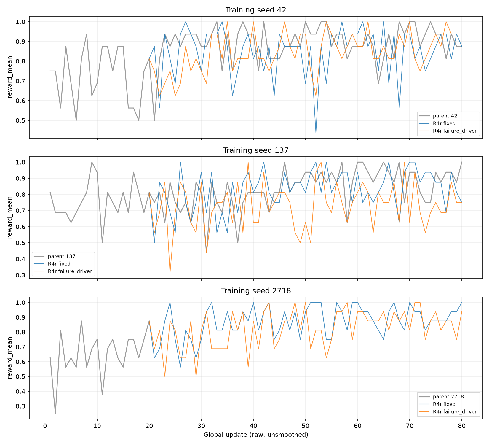
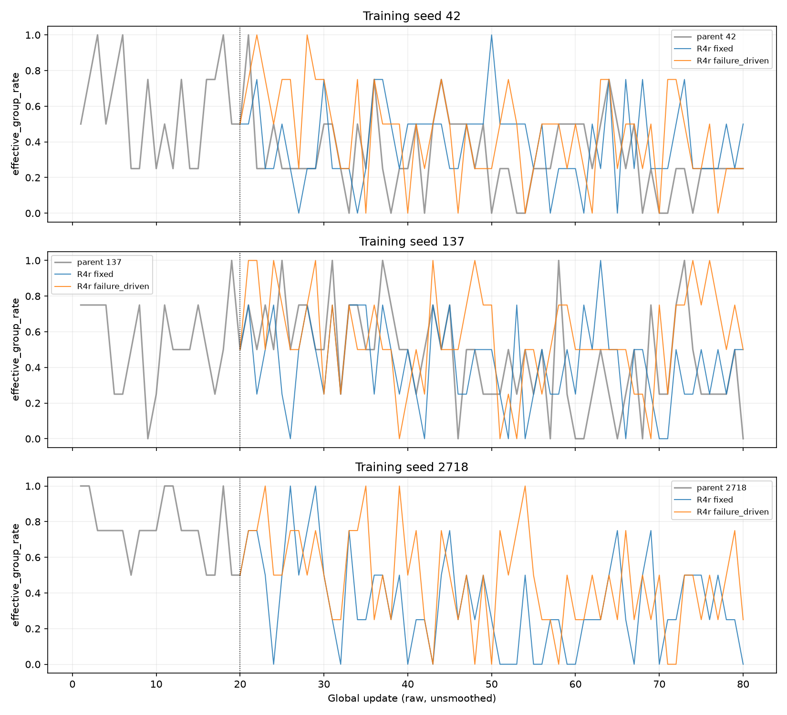
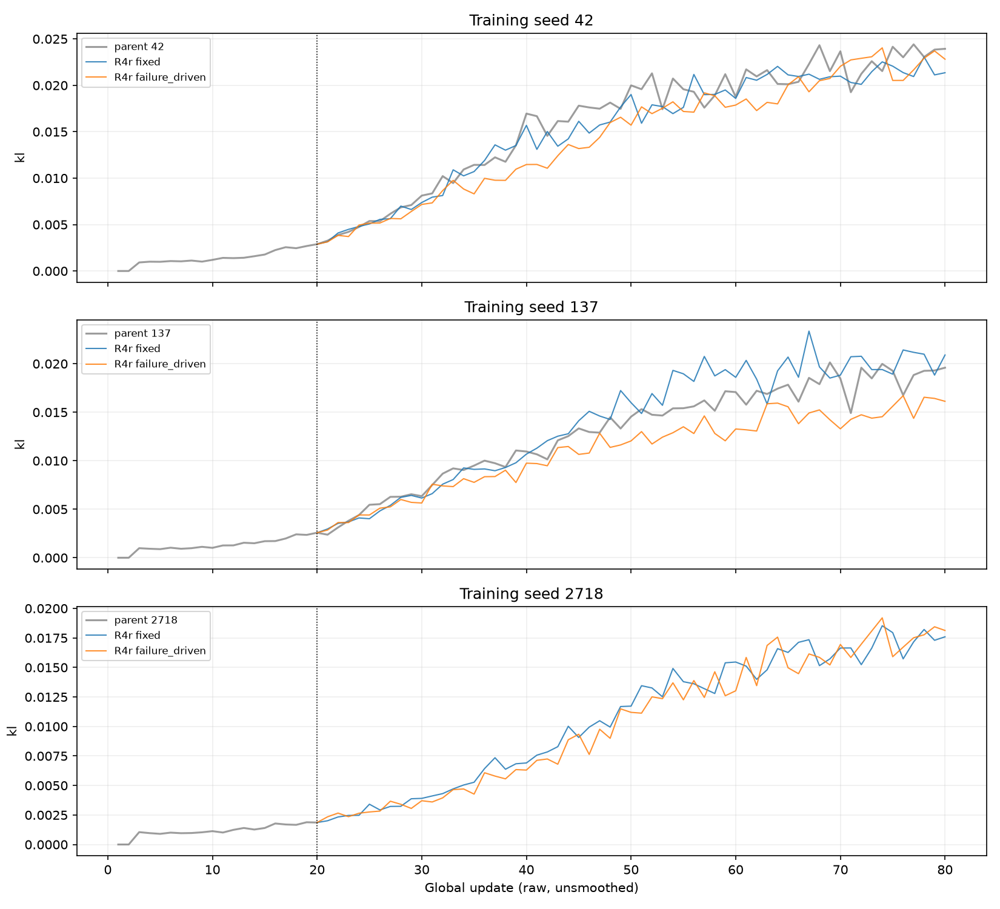
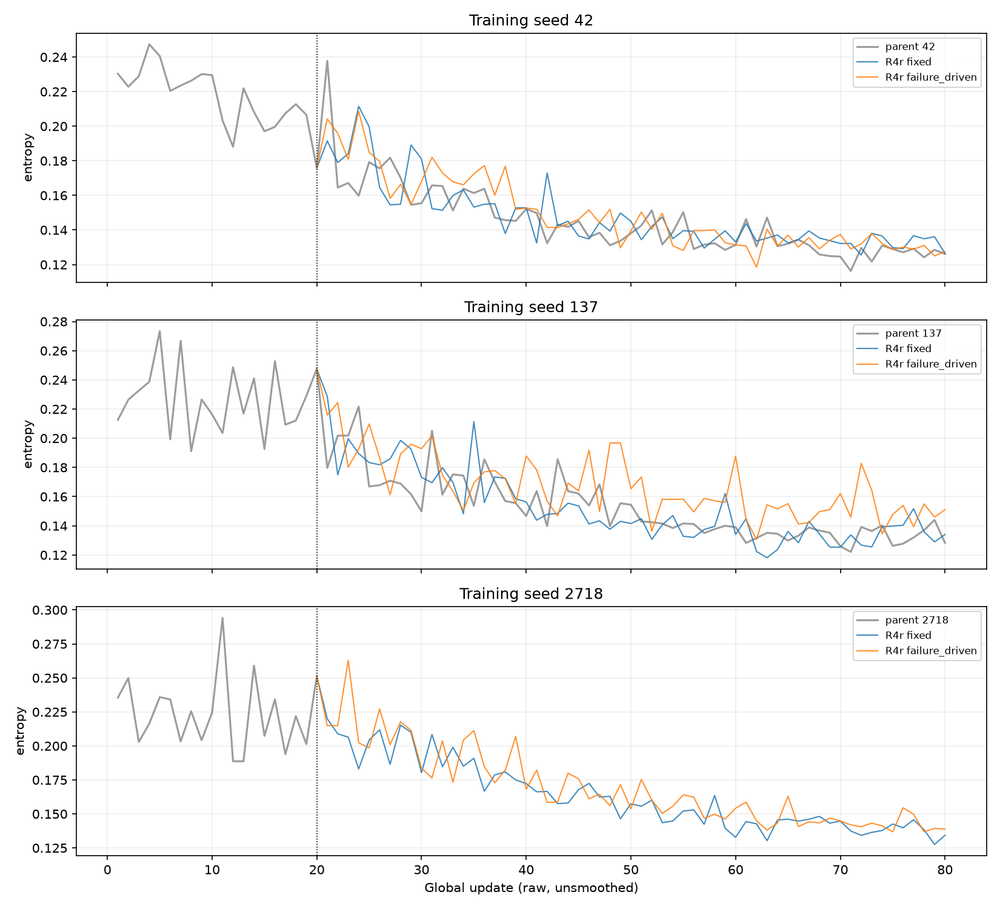
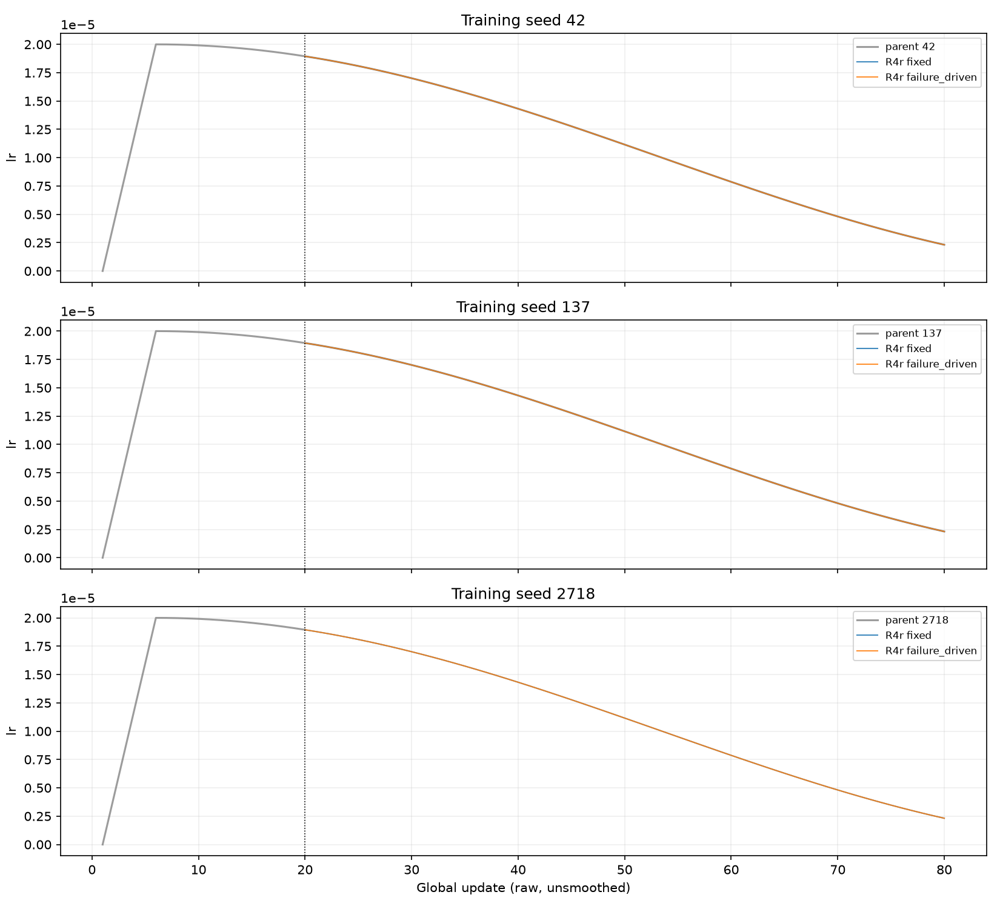

# R5 — Qwen3-4B dev-tool fault-recovery study

Final (2026-09-29): Q1/Q2 on R4r

## 1. Engineering

Completed local provenance and SHA-256 checks for 20 adapters, CPU checks (20 adapters, 504 tensors each, all finite and non-zero LoRA-B), exact evaluation links, training diagnostics and an offline gap audit. R4r remote hashes were not re-verified: the instance is powered off and no local R4r remote hash inventory exists. No GPU, training, evaluation or full base-model load was used for this finalisation.

The provenance manifest is [checkpoint_manifest.json](checkpoint_manifest.json). Weights are ignored by Git. All configs specify rank 16 and alpha 32. Their target-module regex was serialized as a character list; the checker joins it in memory, while full-load mode uses a temporary corrected config. Archived files remain byte-identical. The adapter revision field is consistently null: that field alone cannot establish the base revision. Linked evaluation records identify Qwen3-4B revision `1cfa9a7208912126459214e8b04321603b3df60c`; fork-only adapters rely on recorded lineage and the frozen training contract. R5 did not copy or re-hash base weights.

Parser control: 10488 shared values across all 80 steps agree within `1e-6 * max(1, abs(source))`; no JSONL keys are absent from the log. It ran before reconstruction. Seed 42 contains 84 occurrences: steps 41, 42, 43, and 44 each occur twice. Last occurrence in file order wins. [All duplicate occurrences](raw/r3c_seed42_duplicate_steps.json) retain source line numbers. Reconstructed steps are exactly 1–80. Logged positive checkpoint-save timing at every pruning-record step and U80 agrees with `latest_checkpointed_iteration.txt = 80`; pruning records do not provide an independent reward/loss oracle. See [parser control](diagnostics/parser_control.json) and [reconstruction check](diagnostics/reconstruction_check.json).


R4r logged `actor/lr` agrees with the R3c seed-137 reference at all 380 global steps; maximum absolute difference = 0.0. See [r4r_lr_check.json](diagnostics/r4r_lr_check.json).

## 2. Capability-improvement evidence (Q1)

Q1 verdict: **no_evidence_of_improvement**, verbatim from `artifacts/self_improve/r4r/r4r_analysis_test2.json:/Q1_decision`.

Decision-rule clauses: all three Q1_s > 0 = False (42: -0.0015625, 137: -0.00625, 2718: 0.0484375); pooled CI lower bound > 0 = True; normal guardrail passes = True. The rule requires all clauses, so the positive pooled CI alone does not establish improvement.

Primary endpoint test2 compares fixed-distribution GRPO with base. Base fault rate = 0.6125. Two of three seeds are ≈0 or negative on test2. All rates and differences below are proportions.

| Endpoint | Seed / pooled | Difference | CI95 |
|---|---|---:|---|
| test2 | 42 | -0.0015625 | [-0.0140625, 0.0109375] |
| test2 | 137 | -0.00625 | [-0.021875, 0.009375] |
| test2 | 2718 | 0.0484375 | [0.025, 0.0734375] |
| test2 | pooled | 0.013541666666666667 | [0.0010416666666666667, 0.028125] |
| test_r3 — secondary, no decision authority | 42 | -0.0125 | [-0.03125, 0.0] |
| test_r3 — secondary, no decision authority | 137 | -0.00625 | [-0.01875, 0.0] |
| test_r3 — secondary, no decision authority | 2718 | 0.0375 | [0.00625, 0.08125] |
| test_r3 — secondary, no decision authority | pooled | 0.006249999999999999 | [-0.004166666666666667, 0.018749999999999996] |

Normal guardrail: base rate = 0.3375; all branches pass = True. Exact branch rates appear in the numeric table. The secondary endpoint is labelled secondary, no decision authority.

## 3. Adaptive-mechanism evidence (Q2)

Q2 verdict: **Q2_failure_driven_better**, verbatim from `artifacts/self_improve/r4r/r4r_analysis_test2.json:/Q2_decision`.

Decision-rule clauses: all three Q2_s > 0 = True; pooled CI lower bound > 0 = True; normal guardrail passes = True.

| Endpoint | Seed / pooled | Difference | CI95 |
|---|---|---:|---|
| test2 | 42 | 0.025 | [0.009375, 0.0421875] |
| test2 | 137 | 0.0375 | [0.01875, 0.0578125] |
| test2 | 2718 | 0.0296875 | [0.0109375, 0.05] |
| test2 | pooled | 0.03072916666666667 | [0.0171875, 0.04531249999999999] |
| test_r3 — secondary, no decision authority | 42 | 0.0375 | [0.00625, 0.075] |
| test_r3 — secondary, no decision authority | 137 | 0.03125 | [0.00625, 0.06875] |
| test_r3 — secondary, no decision authority | 2718 | 0.0375 | [0.00625, 0.075] |
| test_r3 — secondary, no decision authority | pooled | 0.03541666666666667 | [0.014583333333333332, 0.06041666666666666] |

Descriptive fault-type breakdown (`descriptive_only`; no cell CIs or tests). Values are equal-weight means across training seeds; n counts instances, not rollouts.

| Endpoint | Fault type | n | Q1 pooled | Q2 pooled |
|---|---|---:|---:|---:|
| test2 | constraint_violation | 60 | 0.018055555555555557 | -0.001388888888888889 |
| test2 | missing_dependency | 52 | 0.019230769230769232 | 0.09455128205128205 |
| test2 | stale_version | 48 | 0.001736111111111111 | 0.0017361111111111112 |
| test_r3 | constraint_violation | 15 | 0.005555555555555556 | 0.011111111111111112 |
| test_r3 | missing_dependency | 13 | 0.019230769230769232 | 0.08974358974358976 |
| test_r3 | stale_version | 12 | -0.006944444444444444 | 0.006944444444444444 |

Selector exposure: actual row counts out of each stage total, in stage order. The fixed allocation follows π0; integer allocation is shown explicitly.

| Branch | constraint_violation | missing_dependency | stale_version | Stage total |
|---|---|---|---|---|
| r4r_fixed_42 | 15 / 15 / 15 / 15 / 15 / 15 | 13 / 13 / 13 / 13 / 13 / 13 | 12 / 12 / 12 / 12 / 12 / 12 | 40 |
| r4r_failure_driven_42 | 9 / 10 / 11 / 10 / 10 / 10 | 19 / 18 / 18 / 20 / 19 / 18 | 12 / 12 / 11 / 10 / 11 / 12 | 40 |
| r4r_fixed_137 | 15 / 15 / 15 / 15 / 15 / 15 | 13 / 13 / 13 / 13 / 13 / 13 | 12 / 12 / 12 / 12 / 12 / 12 | 40 |
| r4r_failure_driven_137 | 12 / 12 / 10 / 10 / 9 / 8 | 19 / 19 / 19 / 21 / 22 / 22 | 9 / 9 / 11 / 9 / 9 / 10 | 40 |
| r4r_fixed_2718 | 15 / 15 / 15 / 15 / 15 / 15 | 13 / 13 / 13 / 13 / 13 / 13 | 12 / 12 / 12 / 12 / 12 / 12 | 40 |
| r4r_failure_driven_2718 | 9 / 10 / 10 / 11 / 10 / 10 | 18 / 19 / 20 / 19 / 19 / 17 | 13 / 11 / 10 / 10 / 11 / 13 | 40 |

In R4, where the realised LR was about 10% of plan, the same up-weighting produced no test gain ([§4](#4-r4--protocol-deviation-case-study)).

Pre-launch power (already recorded; no bootstrap rerun):

| Quantity | Value | Source pointer in `r4r/prelaunch_power.json` |
|---|---:|---|
| coupled_q_hi, shift 0.00 detection | 0.034 | `/conditions/coupled_q_hi/shifts/0.00/detection_rate` |
| coupled_q_hi, shift 0.03 detection | 0.38 | `/conditions/coupled_q_hi/shifts/0.03/detection_rate` |
| coupled_q_hi, shift 0.05 detection | 0.73 | `/conditions/coupled_q_hi/shifts/0.05/detection_rate` |
| coupled_q_hi, shift 0.10 detection | 0.998 | `/conditions/coupled_q_hi/shifts/0.10/detection_rate` |
| coupled_q_hi MDE at 80% power | 0.1 | `/mde_at_80pct_power/coupled_q_hi` |
| coupled_q_lo, shift 0.00 detection | 0.014 | `/conditions/coupled_q_lo/shifts/0.00/detection_rate` |
| coupled_q_lo, shift 0.03 detection | 0.739 | `/conditions/coupled_q_lo/shifts/0.03/detection_rate` |
| coupled_q_lo, shift 0.05 detection | 0.97 | `/conditions/coupled_q_lo/shifts/0.05/detection_rate` |
| coupled_q_lo, shift 0.10 detection | 1.0 | `/conditions/coupled_q_lo/shifts/0.10/detection_rate` |
| coupled_q_lo MDE at 80% power | 0.05 | `/mde_at_80pct_power/coupled_q_lo` |
| independent, shift 0.00 detection | 0.027 | `/conditions/independent/shifts/0.00/detection_rate` |
| independent, shift 0.03 detection | 0.151 | `/conditions/independent/shifts/0.03/detection_rate` |
| independent, shift 0.05 detection | 0.336 | `/conditions/independent/shifts/0.05/detection_rate` |
| independent, shift 0.10 detection | 0.839 | `/conditions/independent/shifts/0.10/detection_rate` |
| independent MDE at 80% power | 0.1 | `/mde_at_80pct_power/independent` |

## 4. R4 — protocol deviation case study

### R4 (protocol deviation: LR horizon)

Historical verdicts: Q1 `no_evidence_of_improvement`, Q2 `no_evidence_of_difference`. These describe the executed protocol deviation.

| Candidate difference | Label | Evidence and interpretation |
|---|---|---|
| 1. Resolved configuration | PRESENT | [resolved_config_diff.json](diagnostics/resolved_config_diff.json), stage records 1–6, includes exact source line spans. Each stage has 13 differing flattened keys: checkpoint contents, adapter/resume paths, data shuffle/file, output names/paths, total epochs and trainer step horizon. Actor hyperparameters in the top-of-log dump otherwise agree. |
| 2. Per-step LR / cosine horizon | PRESENT | [lr_comparison.json](diagnostics/lr_comparison.json), U21–U80. U21 agrees; U22 is 1.863256480957574e-5 for R3c versus 5.742207084349274e-6 for R4. Later R4 stage starts U31/U41/U51/U61/U71 log zero. Remote veRL `trainer/ppo/ray_trainer.py:422–436` overwrites actor optimizer total steps with the stage target; `workers/fsdp_workers.py:930–932` logs LR before scheduler advancement; `utils/torch_functional.py:725–732` closes over the newly constructed horizon. Numbered, hashed excerpts are in [scheduler_source_evidence.json](raw/scheduler_source_evidence.json). R4 re-creates a stage-horizon cosine function while restoring scheduler progress; this is not the uninterrupted 100-step cosine. [scheduler_formula_check.json](diagnostics/scheduler_formula_check.json) reproduces all 60 observed LR values to absolute tolerance 1e-15 from that formula. |
| 2a. Five-step warmup restarted from zero each stage | ABSENT | Same LR record: no new five-step ramp. The first stage update inherits saved LR, then the stage-horizon cosine takes effect. Restore logs record `Loaded lr_scheduler`; see the per-stage restore evidence below. |
| 3. Optimizer discarded between R4 stages | ABSENT | `scripts/self_improve/r4_train_stage.sh:30–40` requires and links optimizer/extra files; `r4_run_branch.py`, `stage_command` and `execute`, pass the previous stage checkpoint and prune it only after the next stage succeeds. [offline_remote_evidence.json](raw/offline_remote_evidence.json), `resume_views`, preserves actual symlink targets; per-stage training logs record optimizer and scheduler loads. `agent_r1_r4.patch` adds only the load-only validation branch. This supports carry-over, not a fresh optimizer each stage. |
| 3a. Exact historical Adam moments at every boundary | NOT DETERMINABLE OFFLINE | Superseded R4 optimizer files were pruned. Restore logs establish load events but cannot reconstruct every historical moment tensor. Existing R4-A3 gate records check the initial fork. |
| 4. Training-row distribution, IDs and ordering | PRESENT | [row_distribution.json](diagnostics/row_distribution.json), R3c and R4-fixed seed 137 U21–U80: each has 240 unique rows, intersection 233. Fault shares differ; full family shares, R3c dump-observed group order and R4 selection order are retained; original R3c within-batch dataloader order is not independently established. R3c uses a shuffled full-pool epoch; R4 uses per-stage stratification and unseen-before-seen cell order followed by a stage permutation (`src/curriculum/failure_driven.py:106–146`). R4 reuses 7 warmup instances, R3c reuses none. R3c numbered dumps match the trajectory ID/reward multiset at all 80 steps. |
| 5. First post-fork U21 metrics | PRESENT | [u21_comparison.json](diagnostics/u21_comparison.json), all metric fields for both runs; reward, entropy, KL and gradient norm differ, while LR agrees. U21 data batches differ, so these are not paired-input comparisons. |
| Seed-noise contribution to the gap | NOT DETERMINABLE OFFLINE | No new training/evaluation or seed-variance experiment is authorized. Seed noise cannot be ruled out offline. |

- Stage 1: `artifacts/self_improve/r5/raw/octorl_r4/seed_137/fixed/stage_1/attempt_1/training.log`, lines 749, 751.
- Stage 2: `artifacts/self_improve/r5/raw/octorl_r4/seed_137/fixed/stage_2/attempt_1/training.log`, lines 749, 751.
- Stage 3: `artifacts/self_improve/r5/raw/octorl_r4/seed_137/fixed/stage_3/attempt_1/training.log`, lines 749, 751.
- Stage 4: `artifacts/self_improve/r5/raw/octorl_r4/seed_137/fixed/stage_4/attempt_1/training.log`, lines 748, 750.
- Stage 5: `artifacts/self_improve/r5/raw/octorl_r4/seed_137/fixed/stage_5/attempt_1/training.log`, lines 748, 750.
- Stage 6: `artifacts/self_improve/r5/raw/octorl_r4/seed_137/fixed/stage_6/attempt_1/training.log`, lines 748, 750.

| U21 metric | R3c 137 | R4 fixed 137 |
|---|---:|---:|
| `r3b/reward_mean` | 0.75 | 0.8125 |
| `r3b/mixed_group_fraction` | 0.75 | 0.5 |
| `actor/kl_loss` | 0.0023777660380801535 | 0.0030392023463718942 |
| `actor/entropy` | 0.1797189861536026 | 0.1779594123363495 |
| `actor/grad_norm` | 0.16167844831943512 | 0.20792342722415924 |
| `actor/lr` | 1.879473751206489e-05 | 1.879473751206489e-05 |

R4r re-ran the study with the preregistered horizon (§1 LR check); R4's verdicts are retained unchanged as the as-run record.


Lesson: health metrics looked normal while the realised LR was about 10% of plan. The fix was to gate on logged `actor/lr`.

## 5. Limitations

- CI covers test-instance and evaluation-sampling uncertainty only; training-seed variance is not estimated (n=3)
- n=3 training seeds, so seed-to-seed variability is not bounded.
- The effect is modest and concentrated in one fault type.
- Dev→test non-transfer for fixed GRPO.
- The R3c-vs-pipeline gap remains. LR is now ruled out. Test2 seed-137 U80 R3c fault rate = 0.646875 (exploratory, not pre-registered), versus R4r fixed = 0.60625. Remaining candidates: stratified row selection / seen-last ordering, per-stage process restarts, seed noise. Not determinable offline.
- Held-out family scope: two families.
- Token-level mask correctness not established.
- R4r adapters' remote hashes not re-verified.
- This is not evidence of general or recursive self-improvement.

## 6. Training diagnostics and attribution

CSV metrics include binary reward, effective-group rate, KL, entropy, response length, gradient norm, clipping, LR, loss and available timing fields. Effective-group rate means reward heterogeneity, not non-zero Sign-advantage fraction. Token-level mask arrays are absent. Offload/sync timing is not isolated by logged aggregate timings. Summed step durations exclude startup and are not billed wall time. Process wall time includes startup; metered costs are estimates from those timings, not day-plan billing.

Curves are raw and unsmoothed; R4r branch lines start at their actual parent U20 point.











Historical deviation plots remain in diagnostics, unchanged.

| Run | Updates | Final policy-gradient loss | Logged step seconds | Process wall seconds | Metered CNY |
|---|---:|---:|---:|---:|---:|
| r3c_42 | 80 | -0.7460432685911655 | 16255.931356353685 | not separately recorded | see ledger |
| r3c_137 | 80 | -1.0000000190921128 | 20013.914764733054 | not separately recorded | see ledger |
| R4 (protocol deviation: LR horizon): r4_fixed_42 | 60 | -0.9286907645873725 | 12235.47382583376 | not separately recorded | see ledger |
| R4 (protocol deviation: LR horizon): r4_failure_driven_42 | 60 | -0.6388259823434055 | 12110.380440071225 | not separately recorded | see ledger |
| R4 (protocol deviation: LR horizon): r4_fixed_137 | 60 | -0.3078629267401993 | 13317.025684767403 | not separately recorded | see ledger |
| R4 (protocol deviation: LR horizon): r4_failure_driven_137 | 60 | -0.47096390929073095 | 12883.281395473517 | not separately recorded | see ledger |
| R4 (protocol deviation: LR horizon): r4_fixed_2718 | 60 | -0.8533743764273822 | 14148.43143397849 | not separately recorded | see ledger |
| R4 (protocol deviation: LR horizon): r4_failure_driven_2718 | 60 | -0.7945069782435894 | 13812.78470969852 | not separately recorded | see ledger |
| R4 (protocol deviation: LR horizon): r4_warmup_2718 | 20 | -0.5826803939417005 | 4818.622027077712 | not separately recorded | see ledger |
| r4r_fixed_42 | 60 | -0.7079907259903848 | 11594.926217720844 | 12190.356712867506 | 7.381938231680879 |
| r4r_failure_driven_42 | 60 | -0.8875934993848205 | 11094.246738614514 | 11671.490987401456 | 7.067736209037549 |
| r4r_fixed_137 | 60 | -0.4678320726379752 | 11451.595404736698 | 12018.157910689712 | 7.277662290362104 |
| r4r_failure_driven_137 | 60 | -0.565942011307925 | 12160.788823620416 | 12732.45008941926 | 7.710205887481664 |
| r4r_fixed_2718 | 60 | -1.0000000251457095 | 11446.256759856828 | 12030.241114947014 | 7.2849793418290245 |
| r4r_failure_driven_2718 | 60 | -0.8943022526800632 | 11670.43953306321 | 12262.324459917843 | 7.425518700728029 |
| r4r_warmup_2718 | 20 | -0.6709217173047364 | 4386.545060457662 | 4472.357302615419 | 2.7082608110282265 |

| Run | Rollouts | Groups | Binary reward | Effective groups | Diagnostic flags |
|---|---:|---:|---:|---:|---|
| R4 (protocol deviation: LR horizon): fixed_42 | 960 | 240 | 0.8 | 0.5458333333333333 | `{"no_read_config": 10, "excessive_queries": 3, "field_not_in_schema": 17}` |
| R4 (protocol deviation: LR horizon): failure_driven_42 | 960 | 240 | 0.7739583333333333 | 0.5625 | `{"field_not_in_schema": 27, "no_read_config": 13, "excessive_queries": 2}` |
| R4 (protocol deviation: LR horizon): fixed_137 | 960 | 240 | 0.7395833333333334 | 0.55 | `{"field_not_in_schema": 24, "excessive_queries": 5, "no_read_config": 35, "invalid_action": 1}` |
| R4 (protocol deviation: LR horizon): failure_driven_137 | 960 | 240 | 0.665625 | 0.6958333333333333 | `{"excessive_queries": 1, "no_read_config": 23, "field_not_in_schema": 17}` |
| R4 (protocol deviation: LR horizon): fixed_2718 | 960 | 240 | 0.7364583333333333 | 0.55 | `{"no_read_config": 31, "field_not_in_schema": 25, "excessive_queries": 4}` |
| R4 (protocol deviation: LR horizon): failure_driven_2718 | 960 | 240 | 0.7145833333333333 | 0.6083333333333333 | `{"no_read_config": 29, "field_not_in_schema": 18, "excessive_queries": 3}` |
| r4r_fixed_42 | 960 | 240 | 0.85 | 0.39166666666666666 | `{"field_not_in_schema": 15, "no_read_config": 3}` |
| r4r_failure_driven_42 | 960 | 240 | 0.8458333333333333 | 0.44583333333333336 | `{"field_not_in_schema": 8, "no_read_config": 5, "excessive_queries": 2}` |
| r4r_fixed_137 | 960 | 240 | 0.828125 | 0.42083333333333334 | `{"field_not_in_schema": 8, "no_read_config": 13, "excessive_queries": 5}` |
| r4r_failure_driven_137 | 960 | 240 | 0.7302083333333333 | 0.5625 | `{"no_read_config": 25, "field_not_in_schema": 20, "excessive_queries": 5}` |
| r4r_fixed_2718 | 960 | 240 | 0.871875 | 0.3458333333333333 | `{"field_not_in_schema": 9, "no_read_config": 12}` |
| r4r_failure_driven_2718 | 960 | 240 | 0.825 | 0.4666666666666667 | `{"field_not_in_schema": 16, "no_read_config": 9, "excessive_queries": 1}` |
| r4r_warmup_2718 | 320 | 80 | 0.653125 | 0.75 | `{"no_read_config": 17, "field_not_in_schema": 15}` |

R4r attribution matches trainer binary reward and mixed-group rate at every recorded step, including warm-up. See [attribution_summary.json](diagnostics/attribution_summary.json).

## 7. Cost ledger

Read-only source: `docs/progress.md` §8. R4r ≈ ¥48.9 metered; ≈ ¥50.35 actual day-plan billing. No pay-as-you-go top-up; instance off at 2026-09-29 ~21:35. Cumulative new-direction ≈ ¥141.4. R5 used no GPU; no CPU currency amount is inferred.

## 8. Resume instructions

Use Qwen3-4B at recorded revision `1cfa9a7208912126459214e8b04321603b3df60c` plus `artifacts/self_improve/r5/checkpoints/r4r_failure_driven_137_u80`. The manifest records the exact evaluation path and lineage. R4r optimizer state exists only remotely at U80 on the kept data disk, as supported by saved optimizer/extra-state log lines in [r4r_resume_evidence.json](diagnostics/r4r_resume_evidence.json); it was not pulled. Current remote availability cannot be re-checked while powered off. Local adapters support a warm start, not exact optimizer-state resume.

```sh
.venv/bin/python scripts/self_improve/r5_load_adapter.py --check-only
# Future full load; not run for this CPU-only contract:
.venv/bin/python scripts/self_improve/r5_load_adapter.py --adapter artifacts/self_improve/r5/checkpoints/r4r_failure_driven_137_u80 --base /absolute/path/to/Qwen3-4B --seed 42
```

## 9. Numeric results table

<!-- numeric-results:start -->
| Result | Value | Source JSON | JSON pointer |
|---|---:|---|---|
| R4r test2 Q1 pooled difference | 0.013541666666666667 | `artifacts/self_improve/r4r/r4r_analysis_test2.json` | `/Q1_pooled/difference` |
| R4r test2 Q1 pooled ci95/0 | 0.0010416666666666667 | `artifacts/self_improve/r4r/r4r_analysis_test2.json` | `/Q1_pooled/ci95/0` |
| R4r test2 Q1 pooled ci95/1 | 0.028125 | `artifacts/self_improve/r4r/r4r_analysis_test2.json` | `/Q1_pooled/ci95/1` |
| R4r test2 Q1 by_seed/42 difference | -0.0015625 | `artifacts/self_improve/r4r/r4r_analysis_test2.json` | `/Q1_by_seed/42/difference` |
| R4r test2 Q1 by_seed/42 ci95/0 | -0.0140625 | `artifacts/self_improve/r4r/r4r_analysis_test2.json` | `/Q1_by_seed/42/ci95/0` |
| R4r test2 Q1 by_seed/42 ci95/1 | 0.0109375 | `artifacts/self_improve/r4r/r4r_analysis_test2.json` | `/Q1_by_seed/42/ci95/1` |
| R4r test2 Q1 by_seed/137 difference | -0.00625 | `artifacts/self_improve/r4r/r4r_analysis_test2.json` | `/Q1_by_seed/137/difference` |
| R4r test2 Q1 by_seed/137 ci95/0 | -0.021875 | `artifacts/self_improve/r4r/r4r_analysis_test2.json` | `/Q1_by_seed/137/ci95/0` |
| R4r test2 Q1 by_seed/137 ci95/1 | 0.009375 | `artifacts/self_improve/r4r/r4r_analysis_test2.json` | `/Q1_by_seed/137/ci95/1` |
| R4r test2 Q1 by_seed/2718 difference | 0.0484375 | `artifacts/self_improve/r4r/r4r_analysis_test2.json` | `/Q1_by_seed/2718/difference` |
| R4r test2 Q1 by_seed/2718 ci95/0 | 0.025 | `artifacts/self_improve/r4r/r4r_analysis_test2.json` | `/Q1_by_seed/2718/ci95/0` |
| R4r test2 Q1 by_seed/2718 ci95/1 | 0.0734375 | `artifacts/self_improve/r4r/r4r_analysis_test2.json` | `/Q1_by_seed/2718/ci95/1` |
| R4r test2 Q2 pooled difference | 0.03072916666666667 | `artifacts/self_improve/r4r/r4r_analysis_test2.json` | `/Q2_pooled/difference` |
| R4r test2 Q2 pooled ci95/0 | 0.0171875 | `artifacts/self_improve/r4r/r4r_analysis_test2.json` | `/Q2_pooled/ci95/0` |
| R4r test2 Q2 pooled ci95/1 | 0.04531249999999999 | `artifacts/self_improve/r4r/r4r_analysis_test2.json` | `/Q2_pooled/ci95/1` |
| R4r test2 Q2 by_seed/42 difference | 0.025 | `artifacts/self_improve/r4r/r4r_analysis_test2.json` | `/Q2_by_seed/42/difference` |
| R4r test2 Q2 by_seed/42 ci95/0 | 0.009375 | `artifacts/self_improve/r4r/r4r_analysis_test2.json` | `/Q2_by_seed/42/ci95/0` |
| R4r test2 Q2 by_seed/42 ci95/1 | 0.0421875 | `artifacts/self_improve/r4r/r4r_analysis_test2.json` | `/Q2_by_seed/42/ci95/1` |
| R4r test2 Q2 by_seed/137 difference | 0.0375 | `artifacts/self_improve/r4r/r4r_analysis_test2.json` | `/Q2_by_seed/137/difference` |
| R4r test2 Q2 by_seed/137 ci95/0 | 0.01875 | `artifacts/self_improve/r4r/r4r_analysis_test2.json` | `/Q2_by_seed/137/ci95/0` |
| R4r test2 Q2 by_seed/137 ci95/1 | 0.0578125 | `artifacts/self_improve/r4r/r4r_analysis_test2.json` | `/Q2_by_seed/137/ci95/1` |
| R4r test2 Q2 by_seed/2718 difference | 0.0296875 | `artifacts/self_improve/r4r/r4r_analysis_test2.json` | `/Q2_by_seed/2718/difference` |
| R4r test2 Q2 by_seed/2718 ci95/0 | 0.0109375 | `artifacts/self_improve/r4r/r4r_analysis_test2.json` | `/Q2_by_seed/2718/ci95/0` |
| R4r test2 Q2 by_seed/2718 ci95/1 | 0.05 | `artifacts/self_improve/r4r/r4r_analysis_test2.json` | `/Q2_by_seed/2718/ci95/1` |
| R4r test2 base normal | 0.3375 | `artifacts/self_improve/r4r/r4r_analysis_test2.json` | `/base_normal_pass_rate` |
| R4r test2 guardrail failure_driven_137 | 0.40625 | `artifacts/self_improve/r4r/r4r_analysis_test2.json` | `/normal_guardrail/failure_driven_137/rate` |
| R4r test2 guardrail failure_driven_2718 | 0.375 | `artifacts/self_improve/r4r/r4r_analysis_test2.json` | `/normal_guardrail/failure_driven_2718/rate` |
| R4r test2 guardrail failure_driven_42 | 0.3875 | `artifacts/self_improve/r4r/r4r_analysis_test2.json` | `/normal_guardrail/failure_driven_42/rate` |
| R4r test2 guardrail fixed_137 | 0.39375 | `artifacts/self_improve/r4r/r4r_analysis_test2.json` | `/normal_guardrail/fixed_137/rate` |
| R4r test2 guardrail fixed_2718 | 0.40625 | `artifacts/self_improve/r4r/r4r_analysis_test2.json` | `/normal_guardrail/fixed_2718/rate` |
| R4r test2 guardrail fixed_42 | 0.4375 | `artifacts/self_improve/r4r/r4r_analysis_test2.json` | `/normal_guardrail/fixed_42/rate` |
| R4r test2 bootstrap_seed | 20260928 | `artifacts/self_improve/r4r/r4r_analysis_test2.json` | `/bootstrap_seed` |
| R4r test2 resamples | 10000 | `artifacts/self_improve/r4r/r4r_analysis_test2.json` | `/resamples` |
| R4r test2 base fault_only_binary_fcr | 0.6125 | `artifacts/self_improve/r4r/test_eval/test2/base.json` | `/fault_only_binary_fcr` |
| R4r test2 base normal_only_binary_pass_rate | 0.3375 | `artifacts/self_improve/r4r/test_eval/test2/base.json` | `/normal_only_binary_pass_rate` |
| R4r test2 failure_driven_137 fault_only_binary_fcr | 0.64375 | `artifacts/self_improve/r4r/test_eval/test2/failure_driven_137.json` | `/fault_only_binary_fcr` |
| R4r test2 failure_driven_137 normal_only_binary_pass_rate | 0.40625 | `artifacts/self_improve/r4r/test_eval/test2/failure_driven_137.json` | `/normal_only_binary_pass_rate` |
| R4r test2 failure_driven_2718 fault_only_binary_fcr | 0.690625 | `artifacts/self_improve/r4r/test_eval/test2/failure_driven_2718.json` | `/fault_only_binary_fcr` |
| R4r test2 failure_driven_2718 normal_only_binary_pass_rate | 0.375 | `artifacts/self_improve/r4r/test_eval/test2/failure_driven_2718.json` | `/normal_only_binary_pass_rate` |
| R4r test2 failure_driven_42 fault_only_binary_fcr | 0.6359375 | `artifacts/self_improve/r4r/test_eval/test2/failure_driven_42.json` | `/fault_only_binary_fcr` |
| R4r test2 failure_driven_42 normal_only_binary_pass_rate | 0.3875 | `artifacts/self_improve/r4r/test_eval/test2/failure_driven_42.json` | `/normal_only_binary_pass_rate` |
| R4r test2 fixed_137 fault_only_binary_fcr | 0.60625 | `artifacts/self_improve/r4r/test_eval/test2/fixed_137.json` | `/fault_only_binary_fcr` |
| R4r test2 fixed_137 normal_only_binary_pass_rate | 0.39375 | `artifacts/self_improve/r4r/test_eval/test2/fixed_137.json` | `/normal_only_binary_pass_rate` |
| R4r test2 fixed_2718 fault_only_binary_fcr | 0.6609375 | `artifacts/self_improve/r4r/test_eval/test2/fixed_2718.json` | `/fault_only_binary_fcr` |
| R4r test2 fixed_2718 normal_only_binary_pass_rate | 0.40625 | `artifacts/self_improve/r4r/test_eval/test2/fixed_2718.json` | `/normal_only_binary_pass_rate` |
| R4r test2 fixed_42 fault_only_binary_fcr | 0.6109375 | `artifacts/self_improve/r4r/test_eval/test2/fixed_42.json` | `/fault_only_binary_fcr` |
| R4r test2 fixed_42 normal_only_binary_pass_rate | 0.4375 | `artifacts/self_improve/r4r/test_eval/test2/fixed_42.json` | `/normal_only_binary_pass_rate` |
| R4r test2 Q1 constraint_violation descriptive_only | 0.018055555555555557 | `artifacts/self_improve/r5/diagnostics/r4r_fault_type_breakdown.json` | `/test2/Q1/cells/constraint_violation/pooled` |
| R4r test2 Q1 missing_dependency descriptive_only | 0.019230769230769232 | `artifacts/self_improve/r5/diagnostics/r4r_fault_type_breakdown.json` | `/test2/Q1/cells/missing_dependency/pooled` |
| R4r test2 Q1 stale_version descriptive_only | 0.001736111111111111 | `artifacts/self_improve/r5/diagnostics/r4r_fault_type_breakdown.json` | `/test2/Q1/cells/stale_version/pooled` |
| R4r test2 Q2 constraint_violation descriptive_only | -0.001388888888888889 | `artifacts/self_improve/r5/diagnostics/r4r_fault_type_breakdown.json` | `/test2/Q2/cells/constraint_violation/pooled` |
| R4r test2 Q2 missing_dependency descriptive_only | 0.09455128205128205 | `artifacts/self_improve/r5/diagnostics/r4r_fault_type_breakdown.json` | `/test2/Q2/cells/missing_dependency/pooled` |
| R4r test2 Q2 stale_version descriptive_only | 0.0017361111111111112 | `artifacts/self_improve/r5/diagnostics/r4r_fault_type_breakdown.json` | `/test2/Q2/cells/stale_version/pooled` |
| R4r test_r3 Q1 pooled difference | 0.006249999999999999 | `artifacts/self_improve/r4r/r4r_analysis_test_r3.json` | `/Q1_pooled/difference` |
| R4r test_r3 Q1 pooled ci95/0 | -0.004166666666666667 | `artifacts/self_improve/r4r/r4r_analysis_test_r3.json` | `/Q1_pooled/ci95/0` |
| R4r test_r3 Q1 pooled ci95/1 | 0.018749999999999996 | `artifacts/self_improve/r4r/r4r_analysis_test_r3.json` | `/Q1_pooled/ci95/1` |
| R4r test_r3 Q1 by_seed/42 difference | -0.0125 | `artifacts/self_improve/r4r/r4r_analysis_test_r3.json` | `/Q1_by_seed/42/difference` |
| R4r test_r3 Q1 by_seed/42 ci95/0 | -0.03125 | `artifacts/self_improve/r4r/r4r_analysis_test_r3.json` | `/Q1_by_seed/42/ci95/0` |
| R4r test_r3 Q1 by_seed/42 ci95/1 | 0.0 | `artifacts/self_improve/r4r/r4r_analysis_test_r3.json` | `/Q1_by_seed/42/ci95/1` |
| R4r test_r3 Q1 by_seed/137 difference | -0.00625 | `artifacts/self_improve/r4r/r4r_analysis_test_r3.json` | `/Q1_by_seed/137/difference` |
| R4r test_r3 Q1 by_seed/137 ci95/0 | -0.01875 | `artifacts/self_improve/r4r/r4r_analysis_test_r3.json` | `/Q1_by_seed/137/ci95/0` |
| R4r test_r3 Q1 by_seed/137 ci95/1 | 0.0 | `artifacts/self_improve/r4r/r4r_analysis_test_r3.json` | `/Q1_by_seed/137/ci95/1` |
| R4r test_r3 Q1 by_seed/2718 difference | 0.0375 | `artifacts/self_improve/r4r/r4r_analysis_test_r3.json` | `/Q1_by_seed/2718/difference` |
| R4r test_r3 Q1 by_seed/2718 ci95/0 | 0.00625 | `artifacts/self_improve/r4r/r4r_analysis_test_r3.json` | `/Q1_by_seed/2718/ci95/0` |
| R4r test_r3 Q1 by_seed/2718 ci95/1 | 0.08125 | `artifacts/self_improve/r4r/r4r_analysis_test_r3.json` | `/Q1_by_seed/2718/ci95/1` |
| R4r test_r3 Q2 pooled difference | 0.03541666666666667 | `artifacts/self_improve/r4r/r4r_analysis_test_r3.json` | `/Q2_pooled/difference` |
| R4r test_r3 Q2 pooled ci95/0 | 0.014583333333333332 | `artifacts/self_improve/r4r/r4r_analysis_test_r3.json` | `/Q2_pooled/ci95/0` |
| R4r test_r3 Q2 pooled ci95/1 | 0.06041666666666666 | `artifacts/self_improve/r4r/r4r_analysis_test_r3.json` | `/Q2_pooled/ci95/1` |
| R4r test_r3 Q2 by_seed/42 difference | 0.0375 | `artifacts/self_improve/r4r/r4r_analysis_test_r3.json` | `/Q2_by_seed/42/difference` |
| R4r test_r3 Q2 by_seed/42 ci95/0 | 0.00625 | `artifacts/self_improve/r4r/r4r_analysis_test_r3.json` | `/Q2_by_seed/42/ci95/0` |
| R4r test_r3 Q2 by_seed/42 ci95/1 | 0.075 | `artifacts/self_improve/r4r/r4r_analysis_test_r3.json` | `/Q2_by_seed/42/ci95/1` |
| R4r test_r3 Q2 by_seed/137 difference | 0.03125 | `artifacts/self_improve/r4r/r4r_analysis_test_r3.json` | `/Q2_by_seed/137/difference` |
| R4r test_r3 Q2 by_seed/137 ci95/0 | 0.00625 | `artifacts/self_improve/r4r/r4r_analysis_test_r3.json` | `/Q2_by_seed/137/ci95/0` |
| R4r test_r3 Q2 by_seed/137 ci95/1 | 0.06875 | `artifacts/self_improve/r4r/r4r_analysis_test_r3.json` | `/Q2_by_seed/137/ci95/1` |
| R4r test_r3 Q2 by_seed/2718 difference | 0.0375 | `artifacts/self_improve/r4r/r4r_analysis_test_r3.json` | `/Q2_by_seed/2718/difference` |
| R4r test_r3 Q2 by_seed/2718 ci95/0 | 0.00625 | `artifacts/self_improve/r4r/r4r_analysis_test_r3.json` | `/Q2_by_seed/2718/ci95/0` |
| R4r test_r3 Q2 by_seed/2718 ci95/1 | 0.075 | `artifacts/self_improve/r4r/r4r_analysis_test_r3.json` | `/Q2_by_seed/2718/ci95/1` |
| R4r test_r3 base normal | 0.725 | `artifacts/self_improve/r4r/r4r_analysis_test_r3.json` | `/base_normal_pass_rate` |
| R4r test_r3 guardrail failure_driven_137 | 0.775 | `artifacts/self_improve/r4r/r4r_analysis_test_r3.json` | `/normal_guardrail/failure_driven_137/rate` |
| R4r test_r3 guardrail failure_driven_2718 | 0.775 | `artifacts/self_improve/r4r/r4r_analysis_test_r3.json` | `/normal_guardrail/failure_driven_2718/rate` |
| R4r test_r3 guardrail failure_driven_42 | 0.75 | `artifacts/self_improve/r4r/r4r_analysis_test_r3.json` | `/normal_guardrail/failure_driven_42/rate` |
| R4r test_r3 guardrail fixed_137 | 0.75 | `artifacts/self_improve/r4r/r4r_analysis_test_r3.json` | `/normal_guardrail/fixed_137/rate` |
| R4r test_r3 guardrail fixed_2718 | 0.725 | `artifacts/self_improve/r4r/r4r_analysis_test_r3.json` | `/normal_guardrail/fixed_2718/rate` |
| R4r test_r3 guardrail fixed_42 | 0.75 | `artifacts/self_improve/r4r/r4r_analysis_test_r3.json` | `/normal_guardrail/fixed_42/rate` |
| R4r test_r3 bootstrap_seed | 20260927 | `artifacts/self_improve/r4r/r4r_analysis_test_r3.json` | `/bootstrap_seed` |
| R4r test_r3 resamples | 10000 | `artifacts/self_improve/r4r/r4r_analysis_test_r3.json` | `/resamples` |
| R4r test_r3 base fault_only_binary_fcr | 0.6375 | `artifacts/self_improve/r4r/test_eval/test_r3/base.json` | `/fault_only_binary_fcr` |
| R4r test_r3 base normal_only_binary_pass_rate | 0.725 | `artifacts/self_improve/r4r/test_eval/test_r3/base.json` | `/normal_only_binary_pass_rate` |
| R4r test_r3 failure_driven_137 fault_only_binary_fcr | 0.6625 | `artifacts/self_improve/r4r/test_eval/test_r3/failure_driven_137.json` | `/fault_only_binary_fcr` |
| R4r test_r3 failure_driven_137 normal_only_binary_pass_rate | 0.775 | `artifacts/self_improve/r4r/test_eval/test_r3/failure_driven_137.json` | `/normal_only_binary_pass_rate` |
| R4r test_r3 failure_driven_2718 fault_only_binary_fcr | 0.7125 | `artifacts/self_improve/r4r/test_eval/test_r3/failure_driven_2718.json` | `/fault_only_binary_fcr` |
| R4r test_r3 failure_driven_2718 normal_only_binary_pass_rate | 0.775 | `artifacts/self_improve/r4r/test_eval/test_r3/failure_driven_2718.json` | `/normal_only_binary_pass_rate` |
| R4r test_r3 failure_driven_42 fault_only_binary_fcr | 0.6625 | `artifacts/self_improve/r4r/test_eval/test_r3/failure_driven_42.json` | `/fault_only_binary_fcr` |
| R4r test_r3 failure_driven_42 normal_only_binary_pass_rate | 0.75 | `artifacts/self_improve/r4r/test_eval/test_r3/failure_driven_42.json` | `/normal_only_binary_pass_rate` |
| R4r test_r3 fixed_137 fault_only_binary_fcr | 0.63125 | `artifacts/self_improve/r4r/test_eval/test_r3/fixed_137.json` | `/fault_only_binary_fcr` |
| R4r test_r3 fixed_137 normal_only_binary_pass_rate | 0.75 | `artifacts/self_improve/r4r/test_eval/test_r3/fixed_137.json` | `/normal_only_binary_pass_rate` |
| R4r test_r3 fixed_2718 fault_only_binary_fcr | 0.675 | `artifacts/self_improve/r4r/test_eval/test_r3/fixed_2718.json` | `/fault_only_binary_fcr` |
| R4r test_r3 fixed_2718 normal_only_binary_pass_rate | 0.725 | `artifacts/self_improve/r4r/test_eval/test_r3/fixed_2718.json` | `/normal_only_binary_pass_rate` |
| R4r test_r3 fixed_42 fault_only_binary_fcr | 0.625 | `artifacts/self_improve/r4r/test_eval/test_r3/fixed_42.json` | `/fault_only_binary_fcr` |
| R4r test_r3 fixed_42 normal_only_binary_pass_rate | 0.75 | `artifacts/self_improve/r4r/test_eval/test_r3/fixed_42.json` | `/normal_only_binary_pass_rate` |
| R4r test_r3 Q1 constraint_violation descriptive_only | 0.005555555555555556 | `artifacts/self_improve/r5/diagnostics/r4r_fault_type_breakdown.json` | `/test_r3/Q1/cells/constraint_violation/pooled` |
| R4r test_r3 Q1 missing_dependency descriptive_only | 0.019230769230769232 | `artifacts/self_improve/r5/diagnostics/r4r_fault_type_breakdown.json` | `/test_r3/Q1/cells/missing_dependency/pooled` |
| R4r test_r3 Q1 stale_version descriptive_only | -0.006944444444444444 | `artifacts/self_improve/r5/diagnostics/r4r_fault_type_breakdown.json` | `/test_r3/Q1/cells/stale_version/pooled` |
| R4r test_r3 Q2 constraint_violation descriptive_only | 0.011111111111111112 | `artifacts/self_improve/r5/diagnostics/r4r_fault_type_breakdown.json` | `/test_r3/Q2/cells/constraint_violation/pooled` |
| R4r test_r3 Q2 missing_dependency descriptive_only | 0.08974358974358976 | `artifacts/self_improve/r5/diagnostics/r4r_fault_type_breakdown.json` | `/test_r3/Q2/cells/missing_dependency/pooled` |
| R4r test_r3 Q2 stale_version descriptive_only | 0.006944444444444444 | `artifacts/self_improve/r5/diagnostics/r4r_fault_type_breakdown.json` | `/test_r3/Q2/cells/stale_version/pooled` |
| r3c_137_u80 fault_only_binary_fcr (exploratory, not pre-registered) | 0.646875 | `artifacts/self_improve/r4r/test_eval/exploratory_test2/r3c_137_u80.json` | `/fault_only_binary_fcr` |
| r3c_137_u80 normal_only_binary_pass_rate (exploratory, not pre-registered) | 0.40625 | `artifacts/self_improve/r4r/test_eval/exploratory_test2/r3c_137_u80.json` | `/normal_only_binary_pass_rate` |
| r3c_42_u80 fault_only_binary_fcr (exploratory, not pre-registered) | 0.61875 | `artifacts/self_improve/r4r/test_eval/exploratory_test2/r3c_42_u80.json` | `/fault_only_binary_fcr` |
| r3c_42_u80 normal_only_binary_pass_rate (exploratory, not pre-registered) | 0.3875 | `artifacts/self_improve/r4r/test_eval/exploratory_test2/r3c_42_u80.json` | `/normal_only_binary_pass_rate` |
| Pre-launch power /aa_ci/0 | 0.0 | `artifacts/self_improve/r4r/prelaunch_power.json` | `/aa_ci/0` |
| Pre-launch power /aa_ci/1 | 0.0 | `artifacts/self_improve/r4r/prelaunch_power.json` | `/aa_ci/1` |
| Pre-launch power /calibrations/coupled_q_hi/fault_rollout_pairs | 160 | `artifacts/self_improve/r4r/prelaunch_power.json` | `/calibrations/coupled_q_hi/fault_rollout_pairs` |
| Pre-launch power /calibrations/coupled_q_hi/independent_null_discordance_rate | 0.14375 | `artifacts/self_improve/r4r/prelaunch_power.json` | `/calibrations/coupled_q_hi/independent_null_discordance_rate` |
| Pre-launch power /calibrations/coupled_q_hi/observed_discordance_rate | 0.0375 | `artifacts/self_improve/r4r/prelaunch_power.json` | `/calibrations/coupled_q_hi/observed_discordance_rate` |
| Pre-launch power /calibrations/coupled_q_hi/q | 0.2608695652173913 | `artifacts/self_improve/r4r/prelaunch_power.json` | `/calibrations/coupled_q_hi/q` |
| Pre-launch power /calibrations/coupled_q_lo/fault_rollout_pairs | 160 | `artifacts/self_improve/r4r/prelaunch_power.json` | `/calibrations/coupled_q_lo/fault_rollout_pairs` |
| Pre-launch power /calibrations/coupled_q_lo/independent_null_discordance_rate | 0.14375 | `artifacts/self_improve/r4r/prelaunch_power.json` | `/calibrations/coupled_q_lo/independent_null_discordance_rate` |
| Pre-launch power /calibrations/coupled_q_lo/observed_discordance_rate | 0.00625 | `artifacts/self_improve/r4r/prelaunch_power.json` | `/calibrations/coupled_q_lo/observed_discordance_rate` |
| Pre-launch power /calibrations/coupled_q_lo/q | 0.04347826086956522 | `artifacts/self_improve/r4r/prelaunch_power.json` | `/calibrations/coupled_q_lo/q` |
| Pre-launch power /conditions/coupled_q_hi/q | 0.2608695652173913 | `artifacts/self_improve/r4r/prelaunch_power.json` | `/conditions/coupled_q_hi/q` |
| Pre-launch power /conditions/coupled_q_hi/shifts/0.00/coverage_of_zero | 0.943 | `artifacts/self_improve/r4r/prelaunch_power.json` | `/conditions/coupled_q_hi/shifts/0.00/coverage_of_zero` |
| Pre-launch power /conditions/coupled_q_hi/shifts/0.00/detection_rate | 0.034 | `artifacts/self_improve/r4r/prelaunch_power.json` | `/conditions/coupled_q_hi/shifts/0.00/detection_rate` |
| Pre-launch power /conditions/coupled_q_hi/shifts/0.00/mean_ci_width | 0.026097539062499994 | `artifacts/self_improve/r4r/prelaunch_power.json` | `/conditions/coupled_q_hi/shifts/0.00/mean_ci_width` |
| Pre-launch power /conditions/coupled_q_hi/shifts/0.03/coverage_of_zero | 0.62 | `artifacts/self_improve/r4r/prelaunch_power.json` | `/conditions/coupled_q_hi/shifts/0.03/coverage_of_zero` |
| Pre-launch power /conditions/coupled_q_hi/shifts/0.03/detection_rate | 0.38 | `artifacts/self_improve/r4r/prelaunch_power.json` | `/conditions/coupled_q_hi/shifts/0.03/detection_rate` |
| Pre-launch power /conditions/coupled_q_hi/shifts/0.03/mean_ci_width | 0.030892734374999998 | `artifacts/self_improve/r4r/prelaunch_power.json` | `/conditions/coupled_q_hi/shifts/0.03/mean_ci_width` |
| Pre-launch power /conditions/coupled_q_hi/shifts/0.05/coverage_of_zero | 0.27 | `artifacts/self_improve/r4r/prelaunch_power.json` | `/conditions/coupled_q_hi/shifts/0.05/coverage_of_zero` |
| Pre-launch power /conditions/coupled_q_hi/shifts/0.05/detection_rate | 0.73 | `artifacts/self_improve/r4r/prelaunch_power.json` | `/conditions/coupled_q_hi/shifts/0.05/detection_rate` |
| Pre-launch power /conditions/coupled_q_hi/shifts/0.05/mean_ci_width | 0.03364476562499999 | `artifacts/self_improve/r4r/prelaunch_power.json` | `/conditions/coupled_q_hi/shifts/0.05/mean_ci_width` |
| Pre-launch power /conditions/coupled_q_hi/shifts/0.10/coverage_of_zero | 0.002 | `artifacts/self_improve/r4r/prelaunch_power.json` | `/conditions/coupled_q_hi/shifts/0.10/coverage_of_zero` |
| Pre-launch power /conditions/coupled_q_hi/shifts/0.10/detection_rate | 0.998 | `artifacts/self_improve/r4r/prelaunch_power.json` | `/conditions/coupled_q_hi/shifts/0.10/detection_rate` |
| Pre-launch power /conditions/coupled_q_hi/shifts/0.10/mean_ci_width | 0.040764804687499996 | `artifacts/self_improve/r4r/prelaunch_power.json` | `/conditions/coupled_q_hi/shifts/0.10/mean_ci_width` |
| Pre-launch power /conditions/coupled_q_lo/q | 0.04347826086956522 | `artifacts/self_improve/r4r/prelaunch_power.json` | `/conditions/coupled_q_lo/q` |
| Pre-launch power /conditions/coupled_q_lo/shifts/0.00/coverage_of_zero | 0.972 | `artifacts/self_improve/r4r/prelaunch_power.json` | `/conditions/coupled_q_lo/shifts/0.00/coverage_of_zero` |
| Pre-launch power /conditions/coupled_q_lo/shifts/0.00/detection_rate | 0.014 | `artifacts/self_improve/r4r/prelaunch_power.json` | `/conditions/coupled_q_lo/shifts/0.00/detection_rate` |
| Pre-launch power /conditions/coupled_q_lo/shifts/0.00/mean_ci_width | 0.009896992187499998 | `artifacts/self_improve/r4r/prelaunch_power.json` | `/conditions/coupled_q_lo/shifts/0.00/mean_ci_width` |
| Pre-launch power /conditions/coupled_q_lo/shifts/0.03/coverage_of_zero | 0.261 | `artifacts/self_improve/r4r/prelaunch_power.json` | `/conditions/coupled_q_lo/shifts/0.03/coverage_of_zero` |
| Pre-launch power /conditions/coupled_q_lo/shifts/0.03/detection_rate | 0.739 | `artifacts/self_improve/r4r/prelaunch_power.json` | `/conditions/coupled_q_lo/shifts/0.03/detection_rate` |
| Pre-launch power /conditions/coupled_q_lo/shifts/0.03/mean_ci_width | 0.020509921874999996 | `artifacts/self_improve/r4r/prelaunch_power.json` | `/conditions/coupled_q_lo/shifts/0.03/mean_ci_width` |
| Pre-launch power /conditions/coupled_q_lo/shifts/0.05/coverage_of_zero | 0.03 | `artifacts/self_improve/r4r/prelaunch_power.json` | `/conditions/coupled_q_lo/shifts/0.05/coverage_of_zero` |
| Pre-launch power /conditions/coupled_q_lo/shifts/0.05/detection_rate | 0.97 | `artifacts/self_improve/r4r/prelaunch_power.json` | `/conditions/coupled_q_lo/shifts/0.05/detection_rate` |
| Pre-launch power /conditions/coupled_q_lo/shifts/0.05/mean_ci_width | 0.025141132812499994 | `artifacts/self_improve/r4r/prelaunch_power.json` | `/conditions/coupled_q_lo/shifts/0.05/mean_ci_width` |
| Pre-launch power /conditions/coupled_q_lo/shifts/0.10/coverage_of_zero | 0.0 | `artifacts/self_improve/r4r/prelaunch_power.json` | `/conditions/coupled_q_lo/shifts/0.10/coverage_of_zero` |
| Pre-launch power /conditions/coupled_q_lo/shifts/0.10/detection_rate | 1.0 | `artifacts/self_improve/r4r/prelaunch_power.json` | `/conditions/coupled_q_lo/shifts/0.10/detection_rate` |
| Pre-launch power /conditions/coupled_q_lo/shifts/0.10/mean_ci_width | 0.03524308593749999 | `artifacts/self_improve/r4r/prelaunch_power.json` | `/conditions/coupled_q_lo/shifts/0.10/mean_ci_width` |
| Pre-launch power /conditions/independent/q | 1.0 | `artifacts/self_improve/r4r/prelaunch_power.json` | `/conditions/independent/q` |
| Pre-launch power /conditions/independent/shifts/0.00/coverage_of_zero | 0.951 | `artifacts/self_improve/r4r/prelaunch_power.json` | `/conditions/independent/shifts/0.00/coverage_of_zero` |
| Pre-launch power /conditions/independent/shifts/0.00/detection_rate | 0.027 | `artifacts/self_improve/r4r/prelaunch_power.json` | `/conditions/independent/shifts/0.00/detection_rate` |
| Pre-launch power /conditions/independent/shifts/0.00/mean_ci_width | 0.05119167968749999 | `artifacts/self_improve/r4r/prelaunch_power.json` | `/conditions/independent/shifts/0.00/mean_ci_width` |
| Pre-launch power /conditions/independent/shifts/0.03/coverage_of_zero | 0.849 | `artifacts/self_improve/r4r/prelaunch_power.json` | `/conditions/independent/shifts/0.03/coverage_of_zero` |
| Pre-launch power /conditions/independent/shifts/0.03/detection_rate | 0.151 | `artifacts/self_improve/r4r/prelaunch_power.json` | `/conditions/independent/shifts/0.03/detection_rate` |
| Pre-launch power /conditions/independent/shifts/0.03/mean_ci_width | 0.05251648437499999 | `artifacts/self_improve/r4r/prelaunch_power.json` | `/conditions/independent/shifts/0.03/mean_ci_width` |
| Pre-launch power /conditions/independent/shifts/0.05/coverage_of_zero | 0.664 | `artifacts/self_improve/r4r/prelaunch_power.json` | `/conditions/independent/shifts/0.05/coverage_of_zero` |
| Pre-launch power /conditions/independent/shifts/0.05/detection_rate | 0.336 | `artifacts/self_improve/r4r/prelaunch_power.json` | `/conditions/independent/shifts/0.05/detection_rate` |
| Pre-launch power /conditions/independent/shifts/0.05/mean_ci_width | 0.05342449218749999 | `artifacts/self_improve/r4r/prelaunch_power.json` | `/conditions/independent/shifts/0.05/mean_ci_width` |
| Pre-launch power /conditions/independent/shifts/0.10/coverage_of_zero | 0.161 | `artifacts/self_improve/r4r/prelaunch_power.json` | `/conditions/independent/shifts/0.10/coverage_of_zero` |
| Pre-launch power /conditions/independent/shifts/0.10/detection_rate | 0.839 | `artifacts/self_improve/r4r/prelaunch_power.json` | `/conditions/independent/shifts/0.10/detection_rate` |
| Pre-launch power /conditions/independent/shifts/0.10/mean_ci_width | 0.056357382812499995 | `artifacts/self_improve/r4r/prelaunch_power.json` | `/conditions/independent/shifts/0.10/mean_ci_width` |
| Pre-launch power /mde_at_80pct_power/coupled_q_hi | 0.1 | `artifacts/self_improve/r4r/prelaunch_power.json` | `/mde_at_80pct_power/coupled_q_hi` |
| Pre-launch power /mde_at_80pct_power/coupled_q_lo | 0.05 | `artifacts/self_improve/r4r/prelaunch_power.json` | `/mde_at_80pct_power/coupled_q_lo` |
| Pre-launch power /mde_at_80pct_power/independent | 0.1 | `artifacts/self_improve/r4r/prelaunch_power.json` | `/mde_at_80pct_power/independent` |
| Pre-launch power /n | 160 | `artifacts/self_improve/r4r/prelaunch_power.json` | `/n` |
| Pre-launch power /reps | 1000 | `artifacts/self_improve/r4r/prelaunch_power.json` | `/reps` |
| Pre-launch power /resamples | 10000 | `artifacts/self_improve/r4r/prelaunch_power.json` | `/resamples` |
| Pre-launch power /seed | 20260928 | `artifacts/self_improve/r4r/prelaunch_power.json` | `/seed` |
| R4 (protocol deviation: LR horizon): Q1 pooled difference | 0.004166666666666667 | `artifacts/self_improve/r4/r4_analysis.json` | `/Q1_pooled/difference` |
| R4 (protocol deviation: LR horizon): Q1 pooled CI lower | 0.0 | `artifacts/self_improve/r4/r4_analysis.json` | `/Q1_pooled/ci95/0` |
| R4 (protocol deviation: LR horizon): Q1 pooled CI upper | 0.010416666666666666 | `artifacts/self_improve/r4/r4_analysis.json` | `/Q1_pooled/ci95/1` |
| R4 (protocol deviation: LR horizon): Q1 seed 42 difference | 0.0 | `artifacts/self_improve/r4/r4_analysis.json` | `/Q1_by_seed/42/difference` |
| R4 (protocol deviation: LR horizon): Q1 seed 42 CI lower | 0.0 | `artifacts/self_improve/r4/r4_analysis.json` | `/Q1_by_seed/42/ci95/0` |
| R4 (protocol deviation: LR horizon): Q1 seed 42 CI upper | 0.0 | `artifacts/self_improve/r4/r4_analysis.json` | `/Q1_by_seed/42/ci95/1` |
| R4 (protocol deviation: LR horizon): Q1 seed 137 difference | 0.0 | `artifacts/self_improve/r4/r4_analysis.json` | `/Q1_by_seed/137/difference` |
| R4 (protocol deviation: LR horizon): Q1 seed 137 CI lower | 0.0 | `artifacts/self_improve/r4/r4_analysis.json` | `/Q1_by_seed/137/ci95/0` |
| R4 (protocol deviation: LR horizon): Q1 seed 137 CI upper | 0.0 | `artifacts/self_improve/r4/r4_analysis.json` | `/Q1_by_seed/137/ci95/1` |
| R4 (protocol deviation: LR horizon): Q1 seed 2718 difference | 0.0125 | `artifacts/self_improve/r4/r4_analysis.json` | `/Q1_by_seed/2718/difference` |
| R4 (protocol deviation: LR horizon): Q1 seed 2718 CI lower | 0.0 | `artifacts/self_improve/r4/r4_analysis.json` | `/Q1_by_seed/2718/ci95/0` |
| R4 (protocol deviation: LR horizon): Q1 seed 2718 CI upper | 0.03125 | `artifacts/self_improve/r4/r4_analysis.json` | `/Q1_by_seed/2718/ci95/1` |
| R4 (protocol deviation: LR horizon): Q2 pooled difference | -0.004166666666666667 | `artifacts/self_improve/r4/r4_analysis.json` | `/Q2_pooled/difference` |
| R4 (protocol deviation: LR horizon): Q2 pooled CI lower | -0.010416666666666666 | `artifacts/self_improve/r4/r4_analysis.json` | `/Q2_pooled/ci95/0` |
| R4 (protocol deviation: LR horizon): Q2 pooled CI upper | 0.0 | `artifacts/self_improve/r4/r4_analysis.json` | `/Q2_pooled/ci95/1` |
| R4 (protocol deviation: LR horizon): Q2 seed 42 difference | 0.0 | `artifacts/self_improve/r4/r4_analysis.json` | `/Q2_by_seed/42/difference` |
| R4 (protocol deviation: LR horizon): Q2 seed 42 CI lower | 0.0 | `artifacts/self_improve/r4/r4_analysis.json` | `/Q2_by_seed/42/ci95/0` |
| R4 (protocol deviation: LR horizon): Q2 seed 42 CI upper | 0.0 | `artifacts/self_improve/r4/r4_analysis.json` | `/Q2_by_seed/42/ci95/1` |
| R4 (protocol deviation: LR horizon): Q2 seed 137 difference | 0.0 | `artifacts/self_improve/r4/r4_analysis.json` | `/Q2_by_seed/137/difference` |
| R4 (protocol deviation: LR horizon): Q2 seed 137 CI lower | 0.0 | `artifacts/self_improve/r4/r4_analysis.json` | `/Q2_by_seed/137/ci95/0` |
| R4 (protocol deviation: LR horizon): Q2 seed 137 CI upper | 0.0 | `artifacts/self_improve/r4/r4_analysis.json` | `/Q2_by_seed/137/ci95/1` |
| R4 (protocol deviation: LR horizon): Q2 seed 2718 difference | -0.0125 | `artifacts/self_improve/r4/r4_analysis.json` | `/Q2_by_seed/2718/difference` |
| R4 (protocol deviation: LR horizon): Q2 seed 2718 CI lower | -0.03125 | `artifacts/self_improve/r4/r4_analysis.json` | `/Q2_by_seed/2718/ci95/0` |
| R4 (protocol deviation: LR horizon): Q2 seed 2718 CI upper | 0.0 | `artifacts/self_improve/r4/r4_analysis.json` | `/Q2_by_seed/2718/ci95/1` |
| R4 (protocol deviation: LR horizon): base fault_only_binary_fcr | 0.6375 | `artifacts/self_improve/r4/test_eval/base.json` | `/fault_only_binary_fcr` |
| R4 (protocol deviation: LR horizon): base normal_only_binary_pass_rate | 0.725 | `artifacts/self_improve/r4/test_eval/base.json` | `/normal_only_binary_pass_rate` |
| R4 (protocol deviation: LR horizon): failure_driven_137 fault_only_binary_fcr | 0.6375 | `artifacts/self_improve/r4/test_eval/failure_driven_137.json` | `/fault_only_binary_fcr` |
| R4 (protocol deviation: LR horizon): failure_driven_137 normal_only_binary_pass_rate | 0.75 | `artifacts/self_improve/r4/test_eval/failure_driven_137.json` | `/normal_only_binary_pass_rate` |
| R4 (protocol deviation: LR horizon): failure_driven_2718 fault_only_binary_fcr | 0.6375 | `artifacts/self_improve/r4/test_eval/failure_driven_2718.json` | `/fault_only_binary_fcr` |
| R4 (protocol deviation: LR horizon): failure_driven_2718 normal_only_binary_pass_rate | 0.725 | `artifacts/self_improve/r4/test_eval/failure_driven_2718.json` | `/normal_only_binary_pass_rate` |
| R4 (protocol deviation: LR horizon): failure_driven_42 fault_only_binary_fcr | 0.6375 | `artifacts/self_improve/r4/test_eval/failure_driven_42.json` | `/fault_only_binary_fcr` |
| R4 (protocol deviation: LR horizon): failure_driven_42 normal_only_binary_pass_rate | 0.725 | `artifacts/self_improve/r4/test_eval/failure_driven_42.json` | `/normal_only_binary_pass_rate` |
| R4 (protocol deviation: LR horizon): fixed_137 fault_only_binary_fcr | 0.6375 | `artifacts/self_improve/r4/test_eval/fixed_137.json` | `/fault_only_binary_fcr` |
| R4 (protocol deviation: LR horizon): fixed_137 normal_only_binary_pass_rate | 0.75 | `artifacts/self_improve/r4/test_eval/fixed_137.json` | `/normal_only_binary_pass_rate` |
| R4 (protocol deviation: LR horizon): fixed_2718 fault_only_binary_fcr | 0.65 | `artifacts/self_improve/r4/test_eval/fixed_2718.json` | `/fault_only_binary_fcr` |
| R4 (protocol deviation: LR horizon): fixed_2718 normal_only_binary_pass_rate | 0.75 | `artifacts/self_improve/r4/test_eval/fixed_2718.json` | `/normal_only_binary_pass_rate` |
| R4 (protocol deviation: LR horizon): fixed_42 fault_only_binary_fcr | 0.6375 | `artifacts/self_improve/r4/test_eval/fixed_42.json` | `/fault_only_binary_fcr` |
| R4 (protocol deviation: LR horizon): fixed_42 normal_only_binary_pass_rate | 0.75 | `artifacts/self_improve/r4/test_eval/fixed_42.json` | `/normal_only_binary_pass_rate` |
| R4 (protocol deviation: LR horizon): r3c_137_u50 fault_only_binary_fcr (exploratory, not pre-registered) | 0.66875 | `artifacts/self_improve/r4/test_eval/exploratory_r3c/r3c_137_u50.json` | `/fault_only_binary_fcr` |
| R4 (protocol deviation: LR horizon): r3c_137_u50 normal_only_binary_pass_rate (exploratory, not pre-registered) | 0.775 | `artifacts/self_improve/r4/test_eval/exploratory_r3c/r3c_137_u50.json` | `/normal_only_binary_pass_rate` |
| R4 (protocol deviation: LR horizon): r3c_137_u80 fault_only_binary_fcr (exploratory, not pre-registered) | 0.675 | `artifacts/self_improve/r4/test_eval/exploratory_r3c/r3c_137_u80.json` | `/fault_only_binary_fcr` |
| R4 (protocol deviation: LR horizon): r3c_137_u80 normal_only_binary_pass_rate (exploratory, not pre-registered) | 0.775 | `artifacts/self_improve/r4/test_eval/exploratory_r3c/r3c_137_u80.json` | `/normal_only_binary_pass_rate` |
| R4 (protocol deviation: LR horizon): r3c_42_u50 fault_only_binary_fcr (exploratory, not pre-registered) | 0.64375 | `artifacts/self_improve/r4/test_eval/exploratory_r3c/r3c_42_u50.json` | `/fault_only_binary_fcr` |
| R4 (protocol deviation: LR horizon): r3c_42_u50 normal_only_binary_pass_rate (exploratory, not pre-registered) | 0.725 | `artifacts/self_improve/r4/test_eval/exploratory_r3c/r3c_42_u50.json` | `/normal_only_binary_pass_rate` |
| R4 (protocol deviation: LR horizon): r3c_42_u80 fault_only_binary_fcr (exploratory, not pre-registered) | 0.64375 | `artifacts/self_improve/r4/test_eval/exploratory_r3c/r3c_42_u80.json` | `/fault_only_binary_fcr` |
| R4 (protocol deviation: LR horizon): r3c_42_u80 normal_only_binary_pass_rate (exploratory, not pre-registered) | 0.75 | `artifacts/self_improve/r4/test_eval/exploratory_r3c/r3c_42_u80.json` | `/normal_only_binary_pass_rate` |
| R4 (protocol deviation: LR horizon): Power independent shift 0.00 | 0.028 | `artifacts/self_improve/r4/r4_analysis.json` | `/synthetic_power/conditions/independent/shifts/0.00/detection_rate` |
| R4 (protocol deviation: LR horizon): Power independent shift 0.05 | 0.134 | `artifacts/self_improve/r4/r4_analysis.json` | `/synthetic_power/conditions/independent/shifts/0.05/detection_rate` |
| R4 (protocol deviation: LR horizon): Power independent shift 0.10 | 0.333 | `artifacts/self_improve/r4/r4_analysis.json` | `/synthetic_power/conditions/independent/shifts/0.10/detection_rate` |
| R4 (protocol deviation: LR horizon): Power coupled_q_lo shift 0.00 | 0.003 | `artifacts/self_improve/r4/r4_analysis.json` | `/synthetic_power/conditions/coupled_q_lo/shifts/0.00/detection_rate` |
| R4 (protocol deviation: LR horizon): Power coupled_q_lo shift 0.05 | 0.461 | `artifacts/self_improve/r4/r4_analysis.json` | `/synthetic_power/conditions/coupled_q_lo/shifts/0.05/detection_rate` |
| R4 (protocol deviation: LR horizon): Power coupled_q_lo shift 0.10 | 0.869 | `artifacts/self_improve/r4/r4_analysis.json` | `/synthetic_power/conditions/coupled_q_lo/shifts/0.10/detection_rate` |
| R4 (protocol deviation: LR horizon): Power coupled_q_hi shift 0.00 | 0.023 | `artifacts/self_improve/r4/r4_analysis.json` | `/synthetic_power/conditions/coupled_q_hi/shifts/0.00/detection_rate` |
| R4 (protocol deviation: LR horizon): Power coupled_q_hi shift 0.05 | 0.24 | `artifacts/self_improve/r4/r4_analysis.json` | `/synthetic_power/conditions/coupled_q_hi/shifts/0.05/detection_rate` |
| R4 (protocol deviation: LR horizon): Power coupled_q_hi shift 0.10 | 0.64 | `artifacts/self_improve/r4/r4_analysis.json` | `/synthetic_power/conditions/coupled_q_hi/shifts/0.10/detection_rate` |
| R4 (protocol deviation: LR horizon): 80%-power MDE, coupled_q_lo | 0.1 | `artifacts/self_improve/r4/r4_analysis.json` | `/synthetic_power/mde_at_80pct_power/coupled_q_lo` |
| R4 (protocol deviation: LR horizon): bootstrap_seed | 20260927 | `artifacts/self_improve/r4/r4_analysis.json` | `/bootstrap_seed` |
| R4 (protocol deviation: LR horizon): resamples | 10000 | `artifacts/self_improve/r4/r4_analysis.json` | `/resamples` |
| R4 (protocol deviation: LR horizon): power simulation seed | 20260927 | `artifacts/self_improve/r4/r4_analysis.json` | `/synthetic_power/seed` |
| R4 (protocol deviation: LR horizon): power simulation repetitions | 1000 | `artifacts/self_improve/r4/r4_analysis.json` | `/synthetic_power/reps` |
<!-- numeric-results:end -->

## 10. Inventory and reproducibility

[checkpoint_manifest.json](checkpoint_manifest.json) records all local file hashes and lineage. [adapter_checks.json](diagnostics/adapter_checks.json) contains CPU tensor checks. R4r remote hashes are explicitly unverified. The warm-up remote adapter path is null because the permitted local records do not establish that literal path. Historical acquisition records remain in `pull_inventory.json` and `raw/`; they do not establish R4r remote hashes.

Reproduce offline with `.venv/bin/python`: `scripts/self_improve/r5_r4r_evidence.py`, `scripts/self_improve/r5_diagnostics.py --r4r-only`, `scripts/self_improve/r5_load_adapter.py --check-only > artifacts/self_improve/r5/diagnostics/adapter_checks.json`, `scripts/self_improve/r5_report.py`, then `scripts/self_improve/r5_verify_report.py`. Tests: `.venv/bin/python -m pytest tests/test_r5_*.py tests/test_r4_*.py tests/test_r4r_*.py`. No analysis bootstrap, training, evaluation, base load or remote access is required. Analysis reproduction commands for both endpoints are shown in README and were not run.
